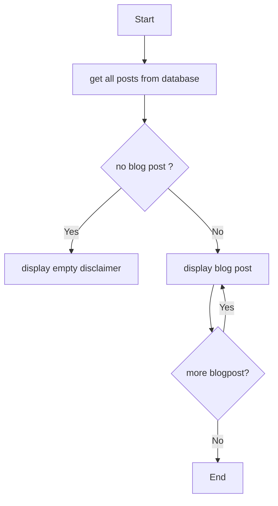
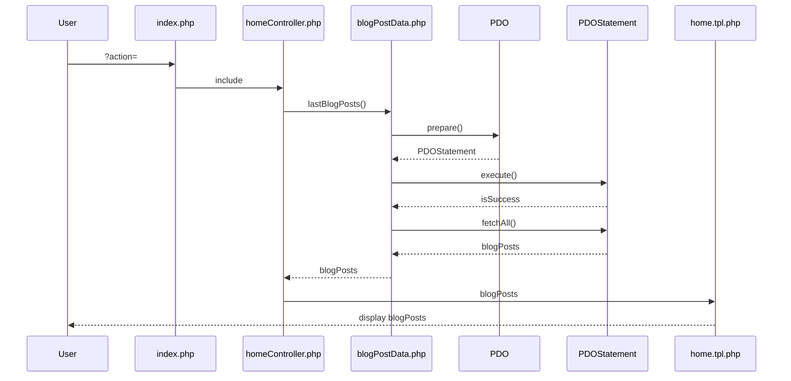
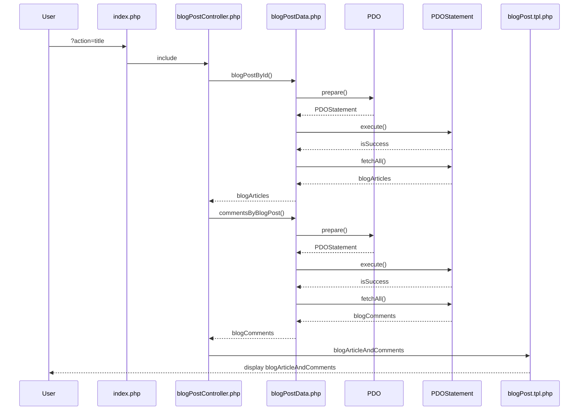
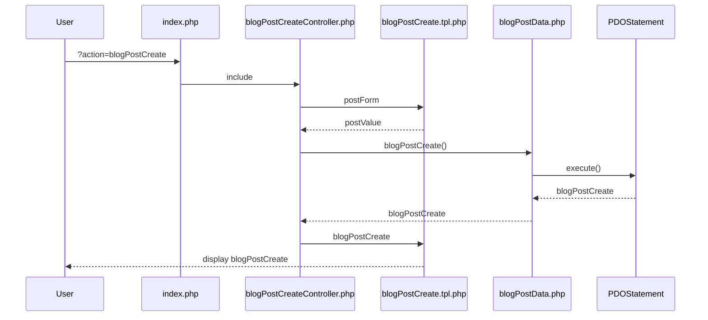
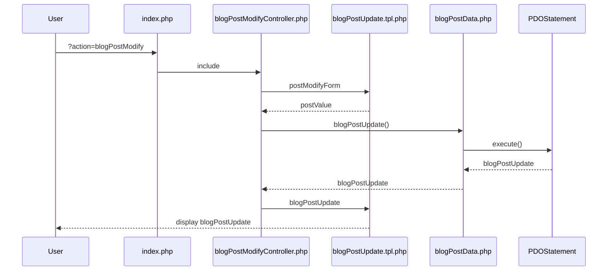
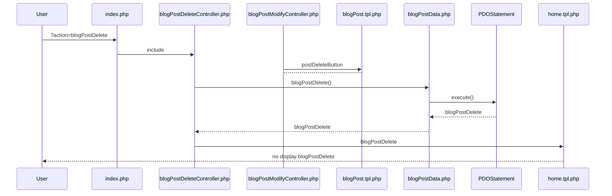

```mermaid
---
Un dessin vaut mieux qu’un long discours
---
graph TD
A[Start] --> B[get all posts from database]
B --> C{no blog post ?}
C -- Yes --> D[display empty disclaimer]
C -- No --> E[display blog post]
E --> F{more blogpost?}
F -- Yes --> E
F -- No --> G[End]
```

```mermaid
---
Un dessin vaut mieux qu’un long discours
---
sequenceDiagram
User->>index.php: ?action=
index.php->>homeController.php: include
homeController.php->>blogPostData.php: lastBlogPosts()
blogPostData.php->>PDO: prepare()
PDO-->>blogPostData.php: PDOStatement
blogPostData.php->>PDOStatement: execute()
PDOStatement-->>blogPostData.php: isSuccess
blogPostData.php->>PDOStatement: fetchAll()
PDOStatement-->>blogPostData.php: blogPosts
blogPostData.php-->>homeController.php: blogPosts
homeController.php->>home.tpl.php: blogPosts
home.tpl.php-->>User: display blogPosts
```

```mermaid
---
Afficher un article
---
sequenceDiagram
User->>index.php: ?action=title
index.php->>blogPostController.php: include
blogPostController.php->>blogPostData.php: blogPostById()
blogPostData.php->>PDO: prepare()
PDO-->>blogPostData.php: PDOStatement
blogPostData.php->>PDOStatement: execute()
PDOStatement-->>blogPostData.php: isSuccess
blogPostData.php->>PDOStatement: fetchAll()
PDOStatement-->>blogPostData.php: blogArticles
blogPostData.php-->>blogPostController.php: blogArticles
blogPostController.php->>blogPostData.php: commentsByBlogPost()
blogPostData.php->>PDO: prepare()
PDO-->>blogPostData.php: PDOStatement
blogPostData.php->>PDOStatement: execute()
PDOStatement-->>blogPostData.php: isSuccess
blogPostData.php->>PDOStatement: fetchAll()
PDOStatement-->>blogPostData.php: blogComments
blogPostData.php-->>blogPostController.php: blogComments
blogPostController.php->>blogPost.tpl.php: blogArticleAndComments
blogPost.tpl.php-->>User: display blogArticleAndComments
```

```mermaid
---
Créer un article
---
sequenceDiagram
User->>index.php: ?action=blogPostCreate
index.php->>blogPostCreateController.php: include
blogPostCreateController.php->>blogPostCreate.tpl.php: postForm
blogPostCreate.tpl.php-->>blogPostCreateController.php: postValue
blogPostCreateController.php->>blogPostData.php: blogPostCreate()
blogPostData.php->>PDOStatement: execute()
PDOStatement-->>blogPostData.php: blogPostCreate
blogPostData.php-->>blogPostCreateController.php: blogPostCreate
blogPostCreateController.php->>blogPostCreate.tpl.php: blogPostCreate
blogPostCreate.tpl.php-->>User: display blogPostCreate
```

```mermaid
---
Modifier un article
---
sequenceDiagram
User->>index.php: ?action=blogPostModify
index.php->>blogPostModifyController.php: include
blogPostModifyController.php->>blogPostUpdate.tpl.php: postModifyForm
blogPostUpdate.tpl.php-->>blogPostModifyController.php: postValue
blogPostModifyController.php->>blogPostData.php: blogPostUpdate()
blogPostData.php->>PDOStatement: execute()
PDOStatement-->>blogPostData.php: blogPostUpdate
blogPostData.php-->>blogPostModifyController.php: blogPostUpdate
blogPostModifyController.php->>blogPostUpdate.tpl.php: blogPostUpdate
blogPostUpdate.tpl.php-->>User: display blogPostUpdate
```

```mermaid
---
Supprimer un article
---
sequenceDiagram
User->>index.php: ?action=blogPostDelete
index.php->>blogPostDeleteController.php: include
blogPostModifyController.php->>blogPost.tpl.php: postDeleteButton
blogPost.tpl.php-->blogPostModifyController.php: 
blogPostDeleteController.php->>blogPostData.php: blogPostDelete()
blogPostData.php->>PDOStatement: execute()
PDOStatement-->>blogPostData.php: blogPostDelete
blogPostData.php-->>blogPostDeleteController.php: blogPostDelete
blogPostDeleteController.php->>home.tpl.php: blogPostDelete
home.tpl.php-->>User: no display blogPostDelete
```